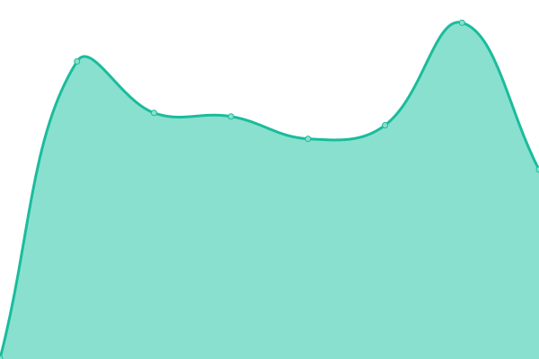

# [📈 Live Status](https://uptime.babsy.ch): <!--live status--> **🟩 All systems operational**

This repository contains the open-source uptime monitor and status page for [stefan-ffr](https://uptime.babsy.ch), powered by [Upptime](https://github.com/upptime/upptime).

With [Upptime](https://upptime.js.org), you can get your own unlimited and free uptime monitor and status page, powered entirely by a GitHub repository. We use [Issues](https://github.com/stefan-ffr/uptime/issues) as incident reports, [Actions](https://github.com/stefan-ffr/uptime/actions) as uptime monitors, and [Pages](https://uptime.babsy.ch) for the status page.

<!--start: status pages-->
<!-- This summary is generated by Upptime (https://github.com/upptime/upptime) -->
<!-- Do not edit this manually, your changes will be overwritten -->
<!-- prettier-ignore -->
| URL | Status | History | Response Time | Uptime |
| --- | ------ | ------- | ------------- | ------ |
|  [Babsy](https://babsy.ch/) | 🟩 Up | [babsy.yml](https://github.com/BabsyIT/uptime/commits/HEAD/history/babsy.yml) | 

 10522ms
     
 | 

<a href="https://uptime.babsy.ch/history/babsy">99.60%</a>
    

|  [Babsy Verein](https://verein.babsy.ch) | 🟩 Up | [babsy-verein.yml](https://github.com/BabsyIT/uptime/commits/HEAD/history/babsy-verein.yml) | 

 1364ms
     
 | 

<a href="https://uptime.babsy.ch/history/babsy-verein">100.00%</a>
    

|  [Babsy Server dashboard-api.babsy.ch](dashboard-api.babsy.ch) | 🟩 Up | [babsy-server-dashboard-api-babsy-ch.yml](https://github.com/BabsyIT/uptime/commits/HEAD/history/babsy-server-dashboard-api-babsy-ch.yml) | 

 110ms
     
 | 

<a href="https://uptime.babsy.ch/history/babsy-server-dashboard-api-babsy-ch">100.00%</a>
    

|  [Babsy Server docker1.infra.babsy.ch](docker1.infra.babsy.ch) | 🟩 Up | [babsy-server-docker1-infra-babsy-ch.yml](https://github.com/BabsyIT/uptime/commits/HEAD/history/babsy-server-docker1-infra-babsy-ch.yml) | 

 118ms
     
 | 

<a href="https://uptime.babsy.ch/history/babsy-server-docker1-infra-babsy-ch">100.00%</a>
    

|  [Babsy Jitsi](https://jitsi.babsy.ch) | 🟩 Up | [babsy-jitsi.yml](https://github.com/BabsyIT/uptime/commits/HEAD/history/babsy-jitsi.yml) | 

 830ms
     
 | 

<a href="https://uptime.babsy.ch/history/babsy-jitsi">100.00%</a>
    

|  [Babsy Bitwarden Passwordmanager](https://bitwarden.babsy.ch) | 🟩 Up | [babsy-bitwarden-passwordmanager.yml](https://github.com/BabsyIT/uptime/commits/HEAD/history/babsy-bitwarden-passwordmanager.yml) | 

 602ms
     
 | 

<a href="https://uptime.babsy.ch/history/babsy-bitwarden-passwordmanager">100.00%</a>
    

|  [Babsy Newslettertool Listmonk](http://newsletter.babsy.ch) | 🟩 Up | [babsy-newslettertool-listmonk.yml](https://github.com/BabsyIT/uptime/commits/HEAD/history/babsy-newslettertool-listmonk.yml) | 

 795ms
     
 | 

<a href="https://uptime.babsy.ch/history/babsy-newslettertool-listmonk">100.00%</a>
    

|  [Babsy Service E-Mail Server Webinterface](https://mail.service.babsy.ch) | 🟩 Up | [babsy-service-e-mail-server-webinterface.yml](https://github.com/BabsyIT/uptime/commits/HEAD/history/babsy-service-e-mail-server-webinterface.yml) | 

 697ms
     
 | 

<a href="https://uptime.babsy.ch/history/babsy-service-e-mail-server-webinterface">100.00%</a>
    

|  [Babsy Service E-Mail Server SMTP](mail.service.babsy.ch) | 🟩 Up | [babsy-service-e-mail-server-smtp.yml](https://github.com/BabsyIT/uptime/commits/HEAD/history/babsy-service-e-mail-server-smtp.yml) | 

 118ms
     
 | 

<a href="https://uptime.babsy.ch/history/babsy-service-e-mail-server-smtp">100.00%</a>
    

|  [Babsy Service E-Mail Server SMTPS](mail.service.babsy.ch) | 🟩 Up | [babsy-service-e-mail-server-smtps.yml](https://github.com/BabsyIT/uptime/commits/HEAD/history/babsy-service-e-mail-server-smtps.yml) | 

 118ms
     
 | 

<a href="https://uptime.babsy.ch/history/babsy-service-e-mail-server-smtps">100.00%</a>
    

|  [Babsy Service E-Mail Server Submission](mail.service.babsy.ch) | 🟩 Up | [babsy-service-e-mail-server-submission.yml](https://github.com/BabsyIT/uptime/commits/HEAD/history/babsy-service-e-mail-server-submission.yml) | 

 118ms
     
 | 

<a href="https://uptime.babsy.ch/history/babsy-service-e-mail-server-submission">100.00%</a>
    

|  [Babsy Service E-Mail Server IMAP](mail.service.babsy.ch) | 🟩 Up | [babsy-service-e-mail-server-imap.yml](https://github.com/BabsyIT/uptime/commits/HEAD/history/babsy-service-e-mail-server-imap.yml) | 

 117ms
     
 | 

<a href="https://uptime.babsy.ch/history/babsy-service-e-mail-server-imap">100.00%</a>
    

|  [Babsy Service E-Mail Server IMAPS](mail.service.babsy.ch) | 🟩 Up | [babsy-service-e-mail-server-imaps.yml](https://github.com/BabsyIT/uptime/commits/HEAD/history/babsy-service-e-mail-server-imaps.yml) | 

 118ms
     
 | 

<a href="https://uptime.babsy.ch/history/babsy-service-e-mail-server-imaps">100.00%</a>
    

|  [Babsy Service E-Mail Server POP3](mail.service.babsy.ch) | 🟩 Up | [babsy-service-e-mail-server-pop-3.yml](https://github.com/BabsyIT/uptime/commits/HEAD/history/babsy-service-e-mail-server-pop-3.yml) | 

 118ms
     
 | 

<a href="https://uptime.babsy.ch/history/babsy-service-e-mail-server-pop-3">100.00%</a>
    

|  [Babsy Service E-Mail Server POP3S](mail.service.babsy.ch) | 🟩 Up | [babsy-service-e-mail-server-pop-3-s.yml](https://github.com/BabsyIT/uptime/commits/HEAD/history/babsy-service-e-mail-server-pop-3-s.yml) | 

 118ms
     
 | 

<a href="https://uptime.babsy.ch/history/babsy-service-e-mail-server-pop-3-s">100.00%</a>
    

|  [Babsy Service E-Mail Server Dovecot ManageSieve](mail.service.babsy.ch) | 🟩 Up | [babsy-service-e-mail-server-dovecot-manage-sieve.yml](https://github.com/BabsyIT/uptime/commits/HEAD/history/babsy-service-e-mail-server-dovecot-manage-sieve.yml) | 

 118ms
     
 | 

<a href="https://uptime.babsy.ch/history/babsy-service-e-mail-server-dovecot-manage-sieve">100.00%</a>
    

|  [Babsy Test Website](https://website.test.babsy.ch) | 🟩 Up | [babsy-test-website.yml](https://github.com/BabsyIT/uptime/commits/HEAD/history/babsy-test-website.yml) | 

 17068ms
     
 | 

<a href="https://uptime.babsy.ch/history/babsy-test-website">82.06%</a>
    

<!--end: status pages-->

[**Visit our status website →**](https://uptime.babsy.ch)

## 📄 License

- Powered by: [Upptime](https://github.com/upptime/upptime)
- Code: [MIT](./LICENSE) © [Anand Chowdhary](https://anandchowdhary.com), supported by [Pabio](https://pabio.com)
- Data in the `./history` directory: [Open Database License](https://opendatacommons.org/licenses/odbl/1-0/)
